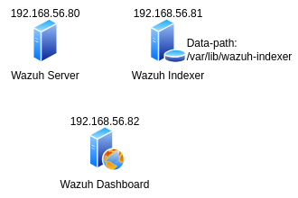

# Instalação do Wazuh - PoC Local usando Vagrant e Virtualbox

Repositório descreve a instalação do Wazuh usando segregação de funções por node, ou seja:
- 01 wazuh-server
- 01 wazuh-indexer
- 01 wazuh-dashboard

Cada um dos nodes acima rodando em uma VM diferente. A figura abaixo ilustra a topologia simplificada:



## Pré-requisitos:

A implantação desse ambiente de prova de conceito local tem alguns pré-requisitos:
- Sistema operacional hospedeiro (host) Ubuntu 22.04. Provável que funcione em outras distros.
- [Virtualbox](https://www.virtualbox.org/). Provável que funcione com outros.
- [Vagrant](https://www.vagrantup.com/)
- Git

A implantação foi executada baseada nos pré-requisitos acima. Se o cenário for diferente, deve-se consultar a documentação das ferramentas para entender como configurar, etc.

## Implantação das Vms

**ATENÇÃO**: Antes de implantar, ajustar as informações constantes no arquivo [environment.yml](environment.yml) conforme a capacidade computadional do host hospedeiro (onde as VMs irão ser executadas). Esse ajuste é importante para evitar problemas, pois no arquivo atual constam 3 VMs, cada uma com 2 vCPUs e 4GB de RAM.

### Instanciar as VMs:

1. Clone esse repo:

    ```bash
    git clone https://github.com/gutobrutus/wazuh-vagrant.git
    ```

2. Acesse o diretório raiz do projeto clonado.

    ```bash
    cd wazuh-vagrant
    ```

3. Ajuste o arquivo [environment.yml](environment.yml) conforme necessário, adequado com a sua realidade, como já chamado atenção anteriormente.

4. Implante/Inicie as VMs:

    ```bash
    vagrant up
    ```
    Aguarde o término do processo. Após finalizar, consulte o status das VMs com:

    ```bash
    vagrant status
    ```
    Saída do comando anterior:
    
    ```bash
    Current machine states:

    wazuh-server              running (virtualbox)
    wazuh-indexer             running (virtualbox)
    wazuh-dashboard           running (virtualbox)

    This environment represents multiple VMs. The VMs are all listed
    above with their current state. For more information about a specific
    VM, run `vagrant status NAME`.
    ```

Pronto, agora as VMs estão implantadas. Para acessar as VMs via ssh, basta:

```bash
vagrant ssh NOME_DA_VM
```
Por exemplo:
```bash
vagrant ssh wazuh-indexer
```

## Instalação do Wazuh

A instalação seguirá na forma multi-node. Para isso, a instalação **deve sempre começar** pelo node indexer.


### Instalação do Wazuh Indexer

1. Acesse a VM wazuh-indexer:
    
    ```bash
    vagrant ssh wazuh-indexer
    ```

2. Eleve para root:
    
    ```bash
    sudo -i
    ```

3. Realize o download do script de instalação:
    
    ```bash
    curl -sO https://packages.wazuh.com/4.5/wazuh-install.sh
    ```

4. Realize o donwload do template de arquivo de configuração:
    
    ```bash
    curl -sO https://packages.wazuh.com/4.5/config.yml
    ```

5. Edite o arquivo config.yml com o seu editor favorito. Exemplo:
    
    ```bash
    vim config.yml
    ```
    
    O conteúdo do arquivo para mim ficou conforme abaixo:
    ```yaml
    nodes:
    # Wazuh indexer nodes
    indexer:
      - name: node-1
        ip: 192.168.56.81
    
    # Wazuh server nodes
    # If there is more than one Wazuh server
    # node, each one must have a node_type
    server:
      - name: wazuh-1
        ip: 192.168.56.80

    # Wazuh dashboard nodes
    dashboard:
      - name: dashboard
        ip: 192.168.56.82
    ```

    O arquivo [config.yml](config.yml) completo que foi descarregado anteriormente está disponível nesse reporitório.

6. Geração de arquivos de configuração:

    ```bash
    bash wazuh-install.sh --generate-config-files
    ```

    Será gerado um arquivo **wazuh-install-files.tar**. Ele deve ser copiado para todas as VMs que compõe a implantação. Com o uso do Vagrant, basta copiar o arquivo para o diretório /vagrant que todas as VMs também terão esse arquivo.

    ```bash
    cp wazuh-install-files.tar /vagrant
    ```

7. Instalação do node indexer:

    ```bash
    bash wazuh-install.sh --wazuh-indexer node-1
    ```

8. Iniciando o cluster:

    ```bash
    bash wazuh-install.sh --start-cluster
    ```
    **Obs.**: Esse passo só necessário executar uma vez no primeiro node indexer.

    Aguardar o processo finalizar.

### Instalação do Wazuh Server

1. Acesse a VM wazuh-server:
    
    ```bash
    vagrant ssh wazuh-indexer
    ```

2. Eleve para root:
    
    ```bash
    sudo -i
    ```

3. Copie o arquivo wazuh-install-files.tar para o diretório corrente:

    ```bash
    cp /vagrant/wazuh-install-files.tar .
    ```

    **Obs.**: A cópia foi feita dessa forma por conta da configuração do ambiente, pois o Vagrant tem o diretório /vagrant disponível em todas as VMs e ele também é mapeado para o diretório raiz do projeto no host hospedeiro. Em outra configuração de ambiente, a cópia deverá ser realizada de outra forma, por exemplo, usando o scp.

4. Realize o download do script de instalação:
    
    ```bash
    curl -sO https://packages.wazuh.com/4.5/wazuh-install.sh
    ```

5. Realize a instalação do Wazuh Server:

    ```bash
    bash wazuh-install.sh --wazuh-server wazuh-1
    ```

    Aguarde o processo finalizar.

### Instalação do Wazuh Dashboard

1. Acesse a VM wazuh-server:
    
    ```bash
    vagrant ssh wazuh-indexer
    ```

2. Eleve para root:
    
    ```bash
    sudo -i
    ```

3. Novamente, copie o arquivo wazuh-install-files.tar para o diretório corrente:

    ```bash
    cp /vagrant/wazuh-install-files.tar .
    ```

4. Realize o download do script de instalação:
    
    ```bash
    curl -sO https://packages.wazuh.com/4.5/wazuh-install.sh
    ```

5. Realize a instalação do Wazuh Server:

    ```bash
    bash wazuh-install.sh --wazuh-dashboard dashboard
    ```

6. Após finalizar a instalação, recupere a senha do usuário admin que será usado para logar no dashboard:

    ```bash
    tar -O -xvf wazuh-install-files.tar wazuh-install-files/wazuh-passwords.txt
    ```

7. Acesse a interface dashboard através da url https://192.168.56.82.

8. Para listar todas as demais credenciais que são usadas pela plataforma do Wazuh:

    ```bash
    tar -O -xvf wazuh-install-files.tar wazuh-install-files/wazuh-passwords.txt
    ```
    Guarde essas credenciais em sua solução de cofre de senhas.

## Observações importantes:
- Em ambientes produtivos ou mesmo de teste dentro de uma rede corporativa, após realizar a instalação/configuração da plataforma Wazuh, guarde o arquivo **wazuh-install-files.tar** em um local seguro. Após isso, delete-o das VMs, visto que se as VMs forem comprometidas, um invasor com esse arquivo terá acesso a todas as configurações, além de todas as credenciais que ficam dentro dele.
- Em ambientes produtivos, recomenda-se criar uma configuração de volumes lógicos criando um LV para o path **/var/lib/wazuh-indexer** nas VMs com a função indexer (Wazuh Indexer), já prevendo problemas de estouro de filesystem. Com o LVM ficará mais fácil gerenciar o aumento de volume do path onde ficam os dados indexados na plataforma Wazuh.
- Ao executar o comando de geração do arquivo de configuração, o arquivo config.yml vai ser excluído. Ele está dentro do wazuh-install-files.tar. Nesse arquivo tem tudo necessário para a instalação, o conteúdo dele pode ser visto com:
    ```bash
    tar -tf wazuh-install-files.tar
    ```
    Saída do comando anterior:

    ```bash
    wazuh-install-files/
    wazuh-install-files/node-1.pem
    wazuh-install-files/config.yml
    wazuh-install-files/dashboard-key.pem
    wazuh-install-files/dashboard.pem
    wazuh-install-files/wazuh-1-key.pem
    wazuh-install-files/admin-key.pem
    wazuh-install-files/node-1-key.pem
    wazuh-install-files/wazuh-passwords.txt
    wazuh-install-files/root-ca.key
    wazuh-install-files/admin.pem
    wazuh-install-files/wazuh-1.pem
    wazuh-install-files/root-ca.pem
    ```

## TODO:
- Documentar processo de incremento de nodes no cluster.
- Documentar implementação de Load Balancer para clusters com mais nodes.

## Referências:
- [Wazuh Cluster](https://documentation.wazuh.com/current/development/wazuh-cluster.html)
- [Wazuh Indexer Install](https://documentation.wazuh.com/current/installation-guide/wazuh-indexer/installation-assistant.html)
- [Wazuh Server Install](https://documentation.wazuh.com/current/installation-guide/wazuh-server/installation-assistant.html)
- [Wazuh Dashboard Install](https://documentation.wazuh.com/current/installation-guide/wazuh-dashboard/installation-assistant.html)
- [PoC Guide - Wazuh](https://documentation.wazuh.com/current/proof-of-concept-guide/index.html) 